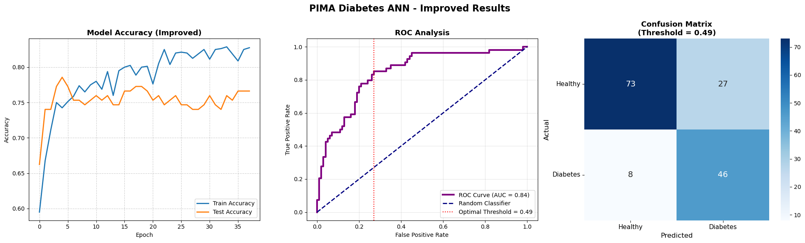

# Diabetes Prediction with Artificial Neural Network

Early-stage diabetes detection using a feedforward neural network trained on the PIMA Indians Diabetes Dataset. The focus of this project is on **clinical reliability** — minimizing missed diagnoses (false negatives) rather than simply maximizing accuracy.

---

## Results

| Metric | Value |
|--------|-------|
| AUC Score | **0.84** |
| Recall (Diabetes) | **85%** |
| Missed Patients (FN) | **8 / 54** |
| Accuracy | ~77% |



---

## Methodology

### 1. Data Preprocessing
- Medically impossible zero values replaced with column means
- Features normalized with `StandardScaler`

### 2. Class Imbalance (SMOTE)
The dataset is imbalanced (500 healthy vs 268 diabetic). SMOTE was applied **after** the train/test split to prevent data leakage — synthetic samples never contaminate the test set.

### 3. Model Architecture

```
Input  → Dense(128) → BatchNorm → Dropout(0.3)
       → Dense(64)  → BatchNorm → Dropout(0.2)
       → Dense(32)  → BatchNorm
       → Dense(2, Softmax)
```

- **BatchNormalization** — stabilizes and speeds up training
- **Dropout** — prevents overfitting
- **Adam (lr=0.0005)** — smooth convergence
- **ReduceLROnPlateau** — auto-adjusts learning rate when stuck
- **EarlyStopping (patience=20)** — stops training at the optimal point

### 4. Threshold Optimization
Instead of the default 0.50 threshold, the optimal threshold was determined from the ROC curve by maximizing the F1-score (optimal = **0.49**). This directly improves recall — the most critical metric in medical classification.

---

## Dataset

**PIMA Indians Diabetes Dataset** — 768 female patients, 8 clinical features:

`Pregnancies` · `Glucose` · `BloodPressure` · `SkinThickness` · `Insulin` · `BMI` · `DiabetesPedigreeFunction` · `Age`

Source: [Kaggle](https://www.kaggle.com/datasets/uciml/pima-indians-diabetes-database) / [Jason Brownlee's mirror](https://raw.githubusercontent.com/jbrownlee/Datasets/master/pima-indians-diabetes.data.csv)

---

## Project Structure

```
diabetes-ann-pima/
├── code/
│   ├── diabetes_ann_pima.ipynb   # Main notebook
│   └── diabetes_ann_pima.py      # Python script version
├── results/
│   ├── results.png               # Accuracy, ROC, Confusion Matrix
│   └── best_model.keras          # Saved model weights
├── report/
│   └── diabetes_ann_report.docx  # Detailed project report
├── requirements.txt
└── .gitignore
```

---

## Installation & Usage

```bash
# Clone the repository
git clone https://github.com/eRamahi/diabetes-ann-pima.git
cd diabetes-ann-pima

# Install dependencies
pip install -r requirements.txt

# Run the script
python code/diabetes_ann_pima.py
```

Or open `code/diabetes_ann_pima.ipynb` directly in Jupyter Notebook.

---

## Author

**Ihab Al Ramahi**
[GitHub](https://github.com/eRamahi) · [LinkedIn](https://linkedin.com/in/ihab-al-ramahi)
